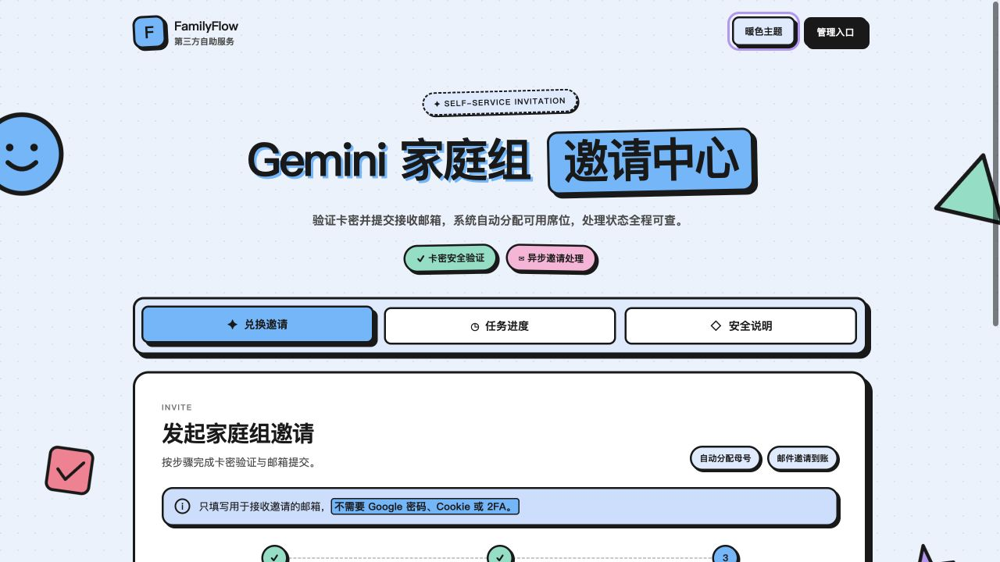
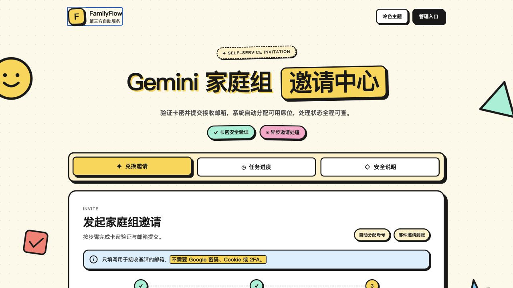
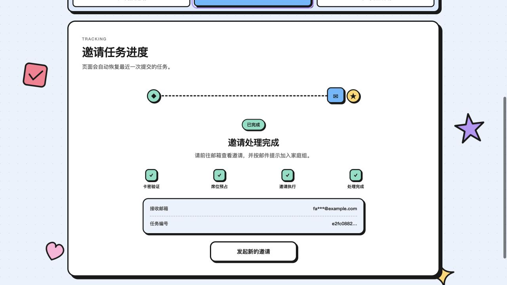
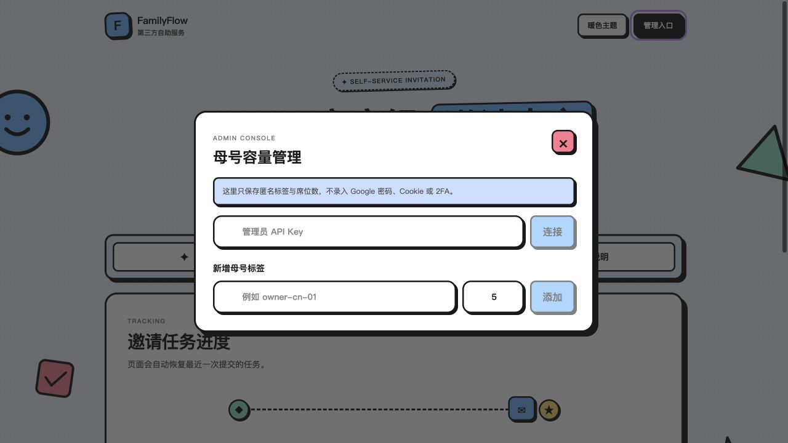
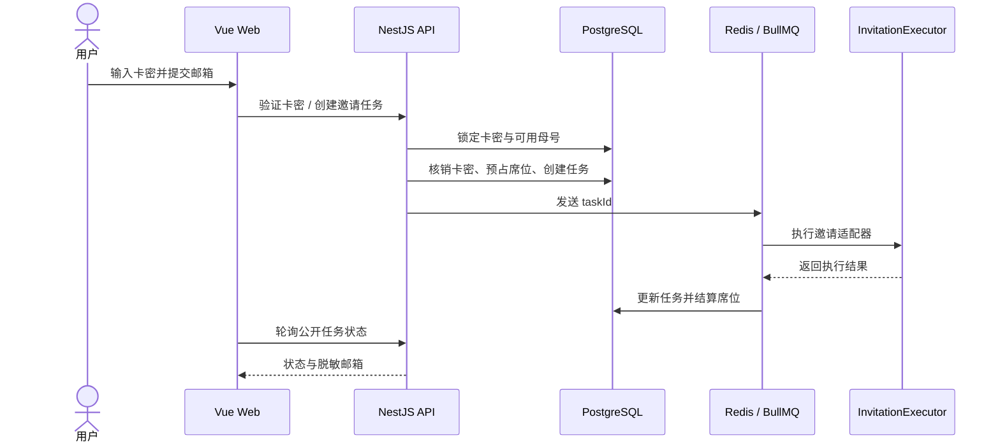

<div align="center">

# Gemini ai pro家庭组自助邀请

### 验证卡密 · 自动预占席位 · 异步执行 · 进度可查


[](https://github.com/wguanfengyue/google-ai-pro-family-invite/actions/workflows/ci.yml)
[](https://github.com/wguanfengyue/google-ai-pro-family-invite/tags)
[](LICENSE)
[](package.json)

</div>

用户验证卡密并提交接收邮箱后，后端会在数据库事务中选择仍有余量的母号、预占席位、创建邀请任务，再通过 Redis 与 BullMQ 异步处理；前端持续展示脱敏后的任务状态。

## 界面预览

<div align="center">
<table>
  <tr>
    <td align="center" width="50%">
      <br />
      <sub><b>用户邀请中心 · 冷色主题</b></sub>
    </td>
    <td align="center" width="50%">
      <br />
      <sub><b>用户邀请中心 · 暖色主题</b></sub>
    </td>
  </tr>
  <tr>
    <td align="center" width="50%">
      <br />
      <sub><b>任务进度 · Mock 流程演示</b></sub>
    </td>
    <td align="center" width="50%">
      <br />
      <sub><b>容量管理 · 后端鉴权入口</b></sub>
    </td>
  </tr>
</table>
</div>

## 项目亮点

- **完整业务闭环**：卡密验证、邮箱提交、席位分配、异步执行、任务查询和管理端容量维护。
- **并发安全**：使用 PostgreSQL `Serializable` 事务、行锁与 `FOR UPDATE SKIP LOCKED`，防止多个请求争抢同一席位。
- **幂等设计**：同一卡密与同一邮箱重复提交返回既有任务，禁止使用同一卡密改绑其他邮箱。
- **异步解耦**：BullMQ 队列只传递任务 ID，不传输邮箱、密码、Cookie、Token 或浏览器会话。
- **隐私保护**：卡密只保存带 pepper 的安全哈希；公开任务接口只展示脱敏邮箱。
- **可替换执行器**：外部邀请能力封装在 `InvitationExecutor` 接口后，默认安全 Mock。
- **工程化交付**：包含 Prisma migration、单元测试、接口集成测试、Docker Compose、Nginx 和 GitHub Actions CI。
- **响应式界面**：Vue 3 卡通新粗野主义界面，支持冷暖主题、移动端布局和任务进度动画。

## 系统流程



详细设计与安全边界见 [架构说明](docs/ARCHITECTURE.md)。

## 技术栈

| 分层 | 技术 |
| --- | --- |
| Web | Vue 3、TypeScript、Vite、Pinia、Vitest |
| API | NestJS、TypeScript、Prisma、Jest、Supertest |
| 数据层 | PostgreSQL 17、Redis 8 |
| 异步任务 | BullMQ |
| 部署 | Docker Compose、Nginx |
| 工程质量 | ESLint、GitHub Actions、Prisma migration |

## 项目结构

```text
.
├── apps/
│   ├── api/                 # NestJS API、Prisma、BullMQ Worker
│   └── web/                 # Vue 3 用户端与容量管理面板
├── docs/                    # 架构、版本和发布说明
├── .github/workflows/       # CI 工作流
├── docker-compose.yml       # PostgreSQL、Redis、API、Web
├── AGENTS.md                # 仓库开发与安全规范
└── .env.example             # 环境变量模板，不包含真实凭证
```

## Docker Compose 快速启动

### 环境要求

- Docker Desktop
- Docker Compose v2

### 1. 准备环境变量

```bash
cp .env.example .env
```

在启动前修改 `.env` 中的数据库密码、`CARD_HASH_PEPPER` 和 `ADMIN_API_KEY`。`.env` 已被 Git 忽略，不要将其提交到仓库。

### 2. 启动服务

```bash
docker compose up -d --build --wait
```

### 3. 写入本地演示数据

```bash
docker compose exec -T api ./node_modules/.bin/tsx apps/api/prisma/seed.ts
```

### 4. 打开页面

- 自助邀请页面：<http://localhost:8080>
- API 健康检查：<http://localhost:8080/api/health>

本地演示数据：

```text
卡密：DEMO-2026-MVP-0001
母号标签：demo-owner-01
管理员密钥：使用本地 .env 中的 ADMIN_API_KEY
```

演示卡密只用于本地 Mock 环境。生产环境不要使用示例密钥、示例卡密或默认数据库密码。

如果本机端口已被占用，可以临时映射其他端口：

```bash
POSTGRES_PORT=5433 REDIS_PORT=6380 WEB_PORT=8088 docker compose up -d --build --wait
```

查看运行状态与日志：

```bash
docker compose ps
docker compose logs -f api
```

停止服务：

```bash
docker compose down
```

该命令不会删除数据库卷。除非明确需要清空本地数据，否则不要添加 `-v`。

## 本地开发

要求 Node.js 22+、npm 11+、PostgreSQL 和 Redis。

```bash
npm install
npm run prisma:generate
npm run db:migrate
npm run db:seed
npm run dev:api
```

另开一个终端启动前端：

```bash
npm run dev:web
```

默认地址：

- Web：<http://localhost:5173>
- API：<http://localhost:3000/api>

Vite 开发服务器会将 `/api` 请求代理到 NestJS。

## API 概览

| 方法 | 路径 | 用途 | 权限 |
| --- | --- | --- | --- |
| `GET` | `/api/health` | 健康检查 | 公开 |
| `POST` | `/api/v1/cards/verify` | 验证卡密 | 公开 |
| `POST` | `/api/v1/invitations` | 创建幂等邀请任务 | 公开 |
| `GET` | `/api/v1/invitations/:id` | 查询任务状态 | 公开 ID |
| `GET` | `/api/v1/admin/owners` | 查询母号容量 | Admin Key |
| `POST` | `/api/v1/admin/owners` | 新增母号标签 | Admin Key |
| `PATCH` | `/api/v1/admin/owners/:id` | 修改母号状态或容量 | Admin Key |

公开接口不会返回完整邮箱、母号标签或内部数据库 ID。当前管理接口使用 `x-admin-key`；完整管理员登录与 RBAC 属于后续版本范围。

## 测试与质量检查

```bash
npm run lint
npm run typecheck
npm run test
npm run build
```

接口集成测试需要 PostgreSQL 和 Redis：

```bash
docker compose up -d --wait postgres redis
npm run db:migrate
npm run test:integration
```

GitHub Actions 会执行依赖安装、Prisma Client 生成、数据库迁移、lint、类型检查、单元测试、关键接口集成测试、生产构建和 Compose 配置检查。

## 安全边界

项目明确不收集或保存：

- Google 账号密码
- 恢复邮箱和 2FA 密钥
- Cookie、OAuth Token 或浏览器会话
- Playwright storage state
- 明文卡密和真实母号凭证

真实 Provider 只能通过服务条款允许的官方接口或人工确认流程实现，并必须放在 `InvitationExecutor` 接口之后。隐藏管理按钮不构成权限控制，所有管理权限都必须由后端校验。

如果用于生产环境，还应补充 HTTPS、速率限制、管理员登录、JWT/RBAC、审计日志、监控告警与备份恢复策略。

## 当前范围与路线图

| 能力 | 状态 |
| --- | --- |
| 卡密验证与安全哈希 | 已完成 |
| 并发席位分配与任务幂等 | 已完成 |
| BullMQ 异步任务与状态查询 | 已完成 |
| Mock 邀请执行器 | 已完成 |
| 卡通响应式用户页面 | 已完成 |
| 母号容量管理面板 | MVP 已完成 |
| 独立管理员页面与登录 | 规划中 |
| JWT、RBAC 与审计日志 | 规划中 |
| 符合服务条款的真实 Provider | 不在当前开源演示中提供 |

## 版本与回滚

- 数据库结构变更必须包含 Prisma migration。
- 部署时使用 `prisma migrate deploy`。
- 发布版本使用不可移动的 Git 标签。
- 代码回滚优先使用 `git revert`，不要移动已发布标签。

版本策略见 [VERSIONING](docs/VERSIONING.md)，首个 MVP 变更见 [v0.1.0 Release Notes](docs/RELEASE_NOTES.md)。

## License

本项目基于 [MIT License](LICENSE) 开源。使用或二次开发时请保留许可证和版权声明，并自行确认业务场景符合相关服务条款与当地法律法规。
