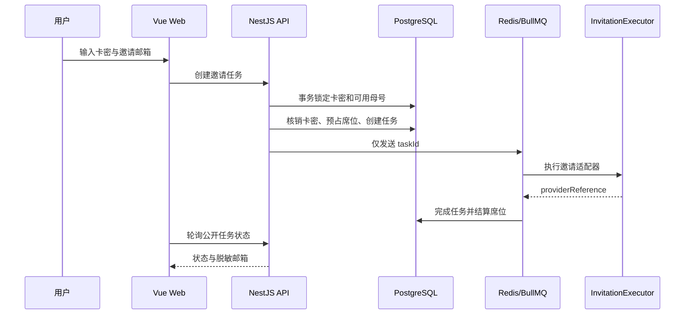

# MVP 架构说明

## 核心流程

## 并发与幂等

- 卡密哈希具有唯一索引，一张卡只关联一个邀请任务。
- 分配母号时使用 PostgreSQL `FOR UPDATE SKIP LOCKED`，避免并发超卖席位。
- 核销卡密、预占席位、创建邀请任务在 `Serializable` 事务内完成。
- BullMQ 的 `jobId` 等于数据库任务 ID；队列消息不携带邮箱、密码、Cookie 或 Token。
- 同一卡密与同一邮箱重复提交返回已有任务；改绑其他邮箱返回冲突。

## 安全边界

- 卡密使用 `SHA-256(pepper + normalizedCode)` 存储，pepper 只来自环境变量。
- 用户状态接口只返回脱敏邮箱。
- 母号表只保存匿名标签、状态和容量。
- 管理接口通过 `x-admin-key` 保护；生产环境应在网关层增加速率限制、HTTPS 和更完整的管理员身份系统。
- 默认 `MockInvitationExecutor` 只模拟成功结果，不会登录或控制 Google 账户。
- `BrowserInvitationExecutor`（实验）只复用本地预认证 Chromium Profile，不执行密码登录、2FA 或验证码绕过；会话失效时任务失败并要求人工重新认证。

## 接入真实 Provider

实现 `InvitationExecutor` 并在 `InvitationsModule` 中替换注入即可。当前实验性浏览器 Provider 通过 `INVITATION_EXECUTOR=browser` 启用，Profile 仅保存在可信机器的本地目录；不应将密码、Cookie、Token、恢复邮箱或 2FA 密钥写入平台数据库、队列或代码仓库。真正的官方 Provider 仍需公开 API 或授权服务商。
